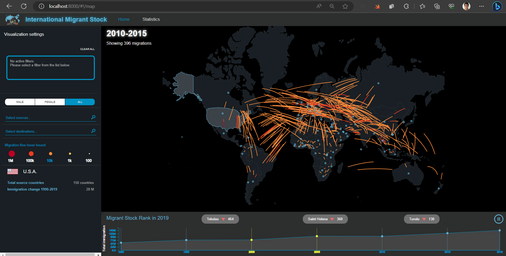

# international migrant stock on UNIMS 2020

An infovis dashboard for international migrant stock from 1990 to 2020 on UNIMS 2020.

[](assets/dashboard.mp4)

For a complete overview, download the recorded .mp4 video from [here](assets/dashboard.mp4) or by clicking on the image above.

## Introduction

The proposed infovis dashboard is a dynamic and interactive tool designed to assist data analysts and general users in monitoring the trends and changes in international migrant stock from 1990 to 2020.

The dashboard, built using [Angularjs](https://angularjs.org/) and [D3.js](https://d3js.org/), offers intuitive visualizations, powerful filtering options, and distinct panels to help users understand global migration patterns over time, focus on country-specific or country-to-country aspects of interest and make informed decisions based on the observed trends.

## Installation

```bash
cd dashboard/
npm ci
```

## Usage

```bash
cd dashboard/
python -m http.server 8080
```

Then, open `localhost:8080` in your browser.

## Dataset

The dashboard sources its data from [UNIMG 2020](https://www.un.org/development/desa/pd/content/international-migrant-stock), a comprehensive and regularly updated census dataset maintained by the United Nations. The dataset provides detailed information on international migrant stock, capturing data at five-year intervals up to the year 2020 (so far). By making use of an authoritative dataset, we are able to ensure accurate and reliable information for both analysis and exploration.

## Authors

- [@DiTo97](https://github.com/DiTo97)
- [@arcadeghira](https://github.com/arcadeghira)
- [@danigit](https://github.com/danigit)

